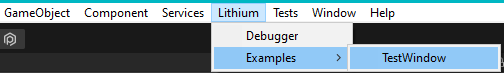
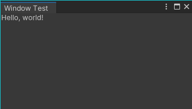
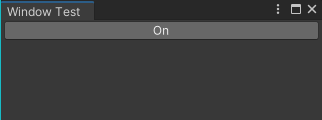
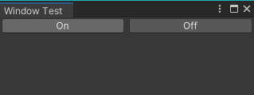

# Quick start guide
## Requirements

Before we start you need to install unity editor 2022.2 or newer as older versions do not support UI Elements based editors and property drawers.

## EditorWindow, custom Editor or Property Drawer?

Before we define our layout, we need to decide where it will be rendered.
Using lithium we can create:

* `Window` by extending `ComposableWindow` instead of `EditorWindow`
* `Editor` by extending `ComposableEditor` instead of `Editor`
* `Property Drawer` by extending `ComposablePropertyDrawer` instead of `PropertyDrawer`

Regardless of your choice, you need to define `IComponent Layout()` method that will by your layout function.

For simplicity, we will create a custom window.

## Defining window

This is the minimal example showing how to create the custom window:

```csharp
using UI.Li.Editor;
using static UI.Li.Common.Common;

public class TestWindow: ComposableWindow
{
    [MenuItem("Lithium/Examples/TestWindow")]
    public static void ShowWindow() => GetWindow<TestWindow>();
    
    protected override string WindowName => "Window Test";
    
    protected override IComponent Layout() => Text("Hello, world!");
}
```





As you can see, the only difference from standard custom window definition is that we override `Layout` instead of `CreateGui`.

## Adding state

Sometimes we need to store some date between renders of our component. That's where `Component` comes in.
It allows us to store some variables in the state object:

```csharp
    protected override IComponent Layout() => WithState(() => Text("Hello, world!"));
```

Now that we can store some values, we can make something dynamic, for example button that toggles between `On` and `Off` text:

```csharp
    protected override IComponent Layout() => WithState(() =>
    {
        var isOn = Remember(false);
        
        return Button(
            content: isOn ? "On" : "Off",
            onClick: () => isOn.Value = !isOn
        );
    });
```

 

## Creating layout

We have created some text and a button, but how do we control how these elements are placed? `Flex` comes to the resque.
It is a simple flex-box component that allows us to position our elements the same way we do it in UI Elements.
To make the code more verbose, two helper functions `Col` and `Row` are provided as shorthands for columns and row layouts respectively. 
For example, if we want to have two buttons side by side, we can simply do:

```csharp
    protected override IComponent Layout() => Row(
        ToggleButton(),
        ToggleButton()
    );

    private static Component ToggleButton() => WithState(() =>
    {
        var isOn = Remember(false);
        
        return Button(
            content: isOn ? "On" : "Off",
            onClick: () => isOn.Value = !isOn
        ).WithStyle(new ( flexGrow: 1 ));
    });
```



Note, that we used `WithStyle` method to attach some styles to the element.

## Further reading

Now that you have your first Lithium-powered window, you can read [documentation](ui.lithium.md) for more information about different components and features of Lithium.