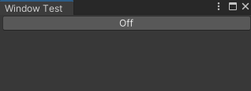

# Quick start guide
## Requirements

Before we start you need to install unity editor 2022.2 or newer as older versions do not support UI Elements based editors and property drawers.

## EditorWindow, custom Editor or Property Drawer?

Before we define our layout, we need to decide where it will be rendered.
Using lithium we can create:

* `Window` by extending `ComposableWindow` instead of `EditorWindow`
* `Editor` by extending `ComposableEditor` instead of `Editor`
* `Property Drawer` by extending `ComposablePropertyDrawer` instead of `PropertyDrawer`

Regardless of your choice, you need to define method `IComposition Layout()` that will by your layout function.

For implementation simplicity we well create custom window.

## Defining window

This is the minimal example showing how to create custom window:

```csharp
using CU = UI.Li.Utils.CompositionUtils;

public class TestWindow: ComposableWindow
{
    [MenuItem("Lithium/Examples/TestWindow")]
    public static void ShowWindow()
    {
        var window = GetWindow<TestWindow>();
        window.titleContent = new GUIContent("Window Test");
    }
    
    protected override IComposition Layout() => CU.Text("Hello, world!");
}
```


As you can see, the only difference from standard custom window definition is that we override `Layout` instead of `CreateGui`.

## Adding state

Sometimes we need to store some date between renders of our component. That's where `Composition` comes in.
It allows us to store some variables in the state object:

```csharp
    protected override IComposition Layout() => new Composition(state =>
    {
        return CU.Text("Hello, world!");
    }, isStatic: true);
```

Now that we can store some values, we can make something dynamic, for example button that toggles between `On` and `Off` text:

```csharp
    protected override IComposition Layout() => new Composition(state =>
    {
        var isOn = state.Remember(false);
        
        return CU.Button(
            content: isOn ? "On" : "Off",
            onClick: () => isOn.Value = !isOn
        );
    }, isStatic: true);
```

 

## Creating layout

We have created some text and a button, but how do we control how these elements are placed? `Flex` comes to the resque.
It is a simple flex-box component that allows us to position our elements the same way we do it in UI Elements.
For example, if we want to have two buttons side by side, we can simply do this:

```csharp
    protected override IComposition Layout() => CU.Flex(
        direction: FlexDirection.Row,
        content: new [] { ToggleButton(), ToggleButton() }
    );

    private static Composition ToggleButton() => new(state =>
    {
        var isOn = state.Remember(false);
        
        return CU.Button(
            data: new( flexGrow: 1 ),
            content: isOn ? "On" : "Off",
            onClick: () => isOn.Value = !isOn
        );
    }, isStatic: true);
```


Couple remarks about this code:
* only set `isStatic` to `true` if you always return same component,
* note, that we used `data` parameter of `CU.Button`(it can be used to modify style properties or callbacks),
* `Layout` not longer returns `Composition`(it no longer contains any state, so it is not needed).

## Further reading

Now that you have your first Lithium-powered window, you can read [documentation](ui.lithium.md) for more information about different components and features of Lithium.